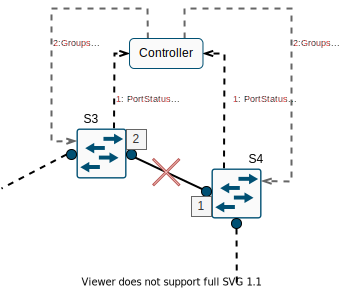
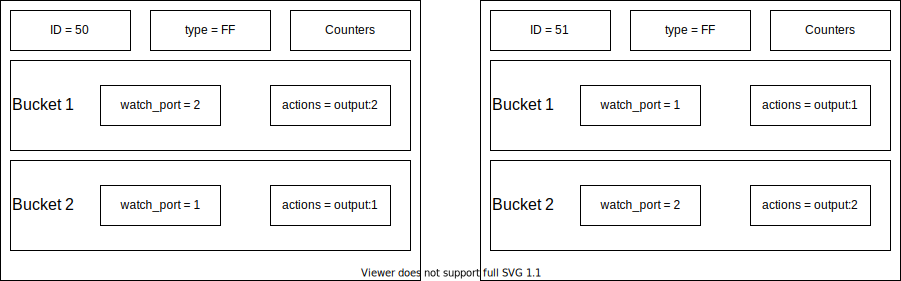
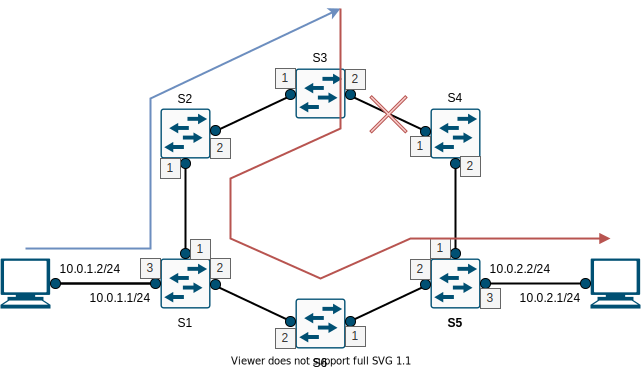
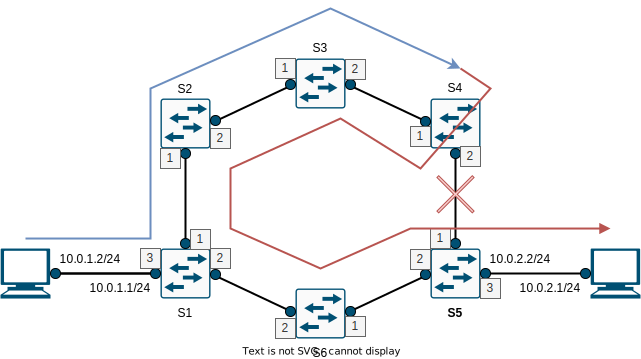

# SDN - Link failure detection

Team members: Giulio Siano

Table of contents:

* Objectives
* Topology
* Paths
* Startup and first configuration
* Periodic monitoring
* On link status changing
* The algorithm
* Pro and cons
* Results
	- With the implemented algorithm
	- Without the implemented algorithm


Usage


## Objectives
1. Design a ring network and monitor the link status through openflow functions
	- Create a mininet topo, and save the link status at each t (time interval)
2. Implement an algorithm to react to the link failure
	- Look at the openflow messages and reconfigure the Openflow tables accordingly (e.g. group tables)
3. Test the algorithm with different traffic generators (D-ITG, iperf)
	- D-itg: http://www.grid.unina.it/software/ITG/
	- Iperf: https://iperf.fr/
4. Display the results
	- Delay, pkt loss with and without the implemented algorithm

## Topology

The topology has been designed with six switches and two hosts which exchange traffic. 


Since it is a ring topology, it can be taken into account an assumption according to which each switch uses only two interfaces to be connected with other switches. Thus, they can be connected with exactly two switches. It can be called **assumption 1**. This topology is set up with the *topologyProject.py* file.

Each of the two hosts has an IP address, a MAC address (*00:00:00:00:00:01* for the first and *00:00:00:00:00:02* for the second) and a default gateway. In the topology the default gateway is represented as an interface of a switch (for example the third of S1 and S5) but actually it is emulated. This raises a problem: when the host h1 (or equivalently h2) sends a packet which destination is out of its network, it sets as destination the mac address of the default gateway, but because it is unknown the host sends an ARP request in broadcast mode. Since no device has that IP address the host is not able to reach any network. To avoid this problem, the mac address of the default gateway is given by configure it manually with the command *arp -s 10.0.1.1 00:00:00:00:00:11* for the host h1, and *arp -s 10.0.2.1 00:00:00:00:00:12* for the host h2 (in this case by *manually* we mean the command is launched explicitly when the *topologyProject.py* file is executed).

## Paths

To make the traffic flow two paths has been identified: the clockwise path (also called *path1*) and the counter-clockwise path (also called *path2*):


These two paths are built by just forwarding to the second interface every packet coming from the first. To have the *path2* is sufficient to reverse the order. Due to the **assumption 1**, these paths is independent on the number of switches. The flow rules implementing this behavior are installed for every switch and they are:

```
    in_port=1,actions=output:2
    in_port=2,actions=output:1
```

To avoid loops for other type of packets, beside the *in_port* other fields to match are specified like *ip_dst*. So, the two rules are executed only if the packet is addressed to h1 or h2. Indeed they are not affected by possible loops since once either the switches s1 or s5 are reached they are delivered to the host.
For this reason, the switches having a host connected (for instance, s1 and s5) require two additional flows: the first forwards to the host every packets having its IP address as destination address, the second sends out from the first interface all packets coming from the host. Below the additional rules for the switch s1:

```
    nw_dst=10.0.1.2,actions=mod_dl_dst:00:00:00:00:00:01,output:3
    in_port=3,actions=output:1
```
## Startup and first configuration

As soon as the switches go online the controller is contacted and the *table miss* rule is installed with the basic ones described in [*Paths*](#paths). The ARP messages are handled by broadcasting them in case the destination MAC address is unknown otherwise by using the learned *mac_to_port* association.

Instead, when the controller starts a separated thread is launched: it executes a function that loops every 10 seconds and accomplishes the first [Objective](#objectives).

## Periodic monitoring

The launched thread captures the link status every 10 second. Indeed, the data can be gathered only if a request from the controller is submitted to the switches using the *OFPPortDescStatsRequest* function. The controller, that has been configured to listen for *EventOFPPortDescStatsReply* events (that is the switches replies), fills a dictionary that for each switch save its active links: those are ones whose state value is *4*.

## On link status changing

This section, together with the next ([the algorithm](#the-algorithm)), accomplishes the second [Objective](#objectives). In particular, a way to get informed about the changing on the link status has been implemented by listening for *EventOFPPortStatus* event: when a link goes down the two incident interfaces go down as well, and their switches send (both of them) a message about the event to the controller. Their ids are then removed from the dictionary of the active interfaces and the algorithm to react to the failure is executed.

Instead, when the two interfaces go online again it is not necessary to perform any action: the dictionary will be updated on the next periodic monitoring. (This is left intentionally to the the periodic monitoring instead of taking any action to show the use of the group tables).

## The algorithm

This algorithm is executed when a link goes down, and so the two incident interfaces go down too. The switches the two interfaces belong to receive a message about their disconnection and, in order to overcome the failure, some group tables and flows are installed. 



In particular, the type of group table that helps to bypass the failed link is the *fast failover* one: it is made of buckets which, in turn, contains a watch port or/and group and a set of actions associated. A group table is used when the flow rule that specifies it as action is matched. The buckets are stored in the order given by the programmer: the selected bucket is the first whose watch port and/or group are enabled/working. If no bucket is matched, the packet is dropped. 
With the buckets of the fast failover group table is possible to implement the two [paths](#paths). Let us define the following group tables: 



The idea behind the two is the following: if a failure involves two interfaces it is necessary to change the traversing of the network from the clockwise direction to the counter-clockwise (or vice versa). It can be summarized by the following sentences: if a packet is received from an interface forward it to the second if available. If not, forward it back from the first if available, drop it otherwise (remember that for the *assumption1* there are only two interfaces on each switch, without considering those for the hosts). The next switches has the flow rules defined in [paths](#paths) (or the pair of group table shown above if previously affected by a failure) and so the packet is forwarded from one interface to another until the switch connected to the destination host is reached. 

The flow necessary to use the two tables are the following:

```
	in_port=1,actions=group:50
	in_port=2,actions=group:51
```



In the example, on S3 the group tables act as a **mirror** and, because the first flow rule is matched, the group whose id is 50 is executed: since the second interface is down, it performs the action shown in the bucket 2. 

When the failed link goes back online, the two interfaces are expected to go back online as well and, as said in [On link status changing](#on-link-status-changing) section nothing changes: the first bucket of each group checks if the *opposite* interface with the respect to the input one is working, so the flow can go on in the same direction. If it does, send through it otherwise use the *mirror* behavior, resulting in the reversing of the direction of the flow. 

In the example above, the first bucket of the first group is about the second interface: when it becomes available again that bucket is used and the packet is correctly forwarded to the switch S4. 

As already explained in [Paths](#paths), the switches having a connected host requires some additional instructions. It is sufficient to use the two flows described above and the second group of flows written in [Paths](#paths), with the modification of the second rule: when those switches receive a packet from the connected host, one of the two groups can be applied indifferently.

```
	in_port=3,actions=group:50
```

Even if the failed link goes back online, the group tables and the flow rules can be still used to normally forward the traffic as shown before. Also, in case of repeated failure the switches already have this tool to quickly react to the event, without the need for instructions by the controller. 

## Pro and cons

The actions and information exchanged between switches and the controller are minimum: the discovery of the topology is indirectly performed when the controller periodically asks for port statuses. In addition, in order to bypass the link failure, no minim path computation is required but the only implementation of group tables, due to the assumptions and considerations made on the topology. 

Also, there are benefits in the long term: once the fast failover group tables are installed, they work both when the fail happens again and when it is resolved. So, once installed no further actions are required. This allows to save the time required by the minimum path time computation (and the consequent exchange of messages with the switches). However, the controller is still informed about the failed/working ports for a matter of statistics and detection of the topology changes.

If the advantages are only about the control plane and the time required to react to the failures, from the point of view of data plane there are some cons. Considering again the image above, once a failure happens and the group tables are installed, since the modifications are performed only on the two interfaces involved in the failure, the switches having the host connected will always send the packet in the direction of S3 wasting bandwidth and time (in this case two hops more are traversed). Those switches have no way to know the failure happened. The worse case is when the failure happens next to the destination host on the "main" path (where main we mean the path initially installed on the switches):



The network is traversed far more than necessary.<br/>
As an alternative solution can be proposed an hybrid approach: to solve the failure in short time the optimal solution is using the fast failover group, while the solution foreseeing with minimum path computation can be applied beside the fast failover group after a certain amount of failure occured or immediately if some strategical links go down, as in the example above.

Another particular case is when both of the two interfaces of a switch fail: in the time between the two failures some packets can arrive to the switch and be stuck in it. Indeed, when the group table is scanned, no interface is working, so the packets are dropped. But this particulare case do not depend on the implemented algorithm.

## Results

### With the implemented algorithm
The test has been conducted in four ways:
1)	No link failure
2)	Link failure
3)	Link failure during traffic exchange
4)	Link failure during traffic exchange and then restoration of the same
<br/>

1) The algorithm has been tested with all the links up, that is the flow exchanged by h1 and h2 follows the clockwise path traversing the switches s1, s2, s3, s4, s5. The iperf3 tool returns that all the traffic has been properly echanged. With the ping tool it has been possible to retrieve the following statistics:

```
--- 10.0.2.2 ping statistics ---
10 packets transmitted, 10 received, 0% packet loss, time 9213ms
rtt min/avg/max/mdev = 0.093/0.110/0.158/0.023 ms
```

These results are useful to compare with the other three test cases.

2) The algorithm has been tested with all the links up except for s3-s4 (in the section [Usage](#usage) are shown the commands used). Still the iperf3 tool returns that all the traffic has been properly exchanged and the ping tool returns the following statistics:

```
--- 10.0.2.2 ping statistics ---
10 packets transmitted, 10 received, 0% packet loss, time 9247ms
rtt min/avg/max/mdev = 0.101/0.131/0.192/0.027 ms
```

These results are perfectly in line with what expected: for what said in section [Pro and cons](#pro-and-cons) the path is longer than the "No link failure" case thus the average RTT is expected to be grater or at least equals (of course since the topology is small the difference is not so appreciable, but there is).

3)	The algorithm has bee tested with all links up at the beginning, then a failure involing the link s3-s4 occurs. Also in this case iperf3 returns that all the traffic has been properly exchanged, but with a difference in statistics:
```
[ 24] local 10.0.2.2 port 39084 connected to 10.0.1.2 port 5201
[ ID] Interval           Transfer     Bandwidth       Retr  Cwnd
[ 24]   0.00-1.00   sec  1.02 GBytes  8.72 Gbits/sec    0   1020 KBytes       
[ 24]   1.00-2.00   sec  1.03 GBytes  8.81 Gbits/sec    0   1.73 MBytes       
[ 24]   2.00-3.00   sec  1.09 GBytes  9.34 Gbits/sec    0   2.33 MBytes       
[ 24]   3.00-4.00   sec   966 MBytes  8.10 Gbits/sec  1406   1.37 MBytes       
[ 24]   4.00-5.00   sec   759 MBytes  6.36 Gbits/sec    1   1.41 MBytes       
[ 24]   5.00-6.00   sec   696 MBytes  5.84 Gbits/sec    0   1.43 MBytes       
[ 24]   6.00-7.00   sec  1015 MBytes  8.52 Gbits/sec    0   1.43 MBytes       
[ 24]   7.00-8.00   sec  1.12 GBytes  9.64 Gbits/sec    0   1.44 MBytes       
[ 24]   8.00-9.00   sec  1.11 GBytes  9.55 Gbits/sec    0   1.44 MBytes       
[ 24]   9.00-10.00  sec  1.12 GBytes  9.64 Gbits/sec    0   1.46 MBytes
```

As it is possible to see, in the time interval 3-4 seconds several retransmissions (1406) were needed. This happened on link failure. The next data suggest the algorithm has been executed and the fast failover groups correctly redirect all the traffic resulting in no traffic loss. Indeed, the ping tool returns the following statistics:

```
PING 10.0.2.2 (10.0.2.2) 56(84) bytes of data.
64 bytes from 10.0.2.2: icmp_seq=1 ttl=64 time=0.096 ms
64 bytes from 10.0.2.2: icmp_seq=2 ttl=64 time=0.122 ms
64 bytes from 10.0.2.2: icmp_seq=3 ttl=64 time=0.159 ms
64 bytes from 10.0.2.2: icmp_seq=4 ttl=64 time=1.61 ms
64 bytes from 10.0.2.2: icmp_seq=5 ttl=64 time=0.231 ms
64 bytes from 10.0.2.2: icmp_seq=6 ttl=64 time=0.105 ms
64 bytes from 10.0.2.2: icmp_seq=7 ttl=64 time=0.105 ms
64 bytes from 10.0.2.2: icmp_seq=8 ttl=64 time=0.101 ms
64 bytes from 10.0.2.2: icmp_seq=9 ttl=64 time=0.105 ms
64 bytes from 10.0.2.2: icmp_seq=10 ttl=64 time=0.133 ms

--- 10.0.2.2 ping statistics ---
10 packets transmitted, 10 received, 0% packet loss, time 9222ms
rtt min/avg/max/mdev = 0.096/0.276/1.611/0.446 ms
```
The average Round Trip Time and the Standard Deviation are clearly higher but after the peak the flow goes on as usual.

4) This test has been reported to show how fast failover group tables are in case of repeated fails and in case of recovery of the link. During the traffic exchange the links is put down and then up again. The iperf tool gives the following statistics:
```
Connecting to host 10.0.1.2, port 5201
[ 24] local 10.0.2.2 port 39154 connected to 10.0.1.2 port 5201
[ ID] Interval           Transfer     Bandwidth       Retr  Cwnd
[ 24]   0.00-1.00   sec  1.04 GBytes  8.97 Gbits/sec    1    938 KBytes       
[ 24]   1.00-2.00   sec  1.14 GBytes  9.81 Gbits/sec    0    938 KBytes       
[ 24]   2.00-3.00   sec   826 MBytes  6.93 Gbits/sec  624    666 KBytes       
[ 24]   3.00-4.00   sec   936 MBytes  7.85 Gbits/sec    0    752 KBytes       
[ 24]   4.00-5.00   sec   953 MBytes  7.99 Gbits/sec    0    837 KBytes       
[ 24]   5.00-6.00   sec  1.10 GBytes  9.45 Gbits/sec    0    872 KBytes       
[ 24]   6.00-7.00   sec  1.14 GBytes  9.78 Gbits/sec    0    895 KBytes       
[ 24]   7.00-8.00   sec   892 MBytes  7.48 Gbits/sec  278    458 KBytes       
[ 24]   8.00-9.00   sec   944 MBytes  7.92 Gbits/sec    0    503 KBytes       
[ 24]   9.00-10.00  sec   845 MBytes  7.09 Gbits/sec    0    597 KBytes   
```
At interval 2-3 the link is put down then at 7-8 up again where the number of retransmissions are far less than when the link went down. The tool ping retuns the following statistics:
```
PING 10.0.2.2 (10.0.2.2) 56(84) bytes of data.
64 bytes from 10.0.2.2: icmp_seq=1 ttl=64 time=0.957 ms
64 bytes from 10.0.2.2: icmp_seq=2 ttl=64 time=0.094 ms
64 bytes from 10.0.2.2: icmp_seq=3 ttl=64 time=0.152 ms
64 bytes from 10.0.2.2: icmp_seq=4 ttl=64 time=1.70 ms
64 bytes from 10.0.2.2: icmp_seq=5 ttl=64 time=0.112 ms
64 bytes from 10.0.2.2: icmp_seq=6 ttl=64 time=0.102 ms
64 bytes from 10.0.2.2: icmp_seq=7 ttl=64 time=0.103 ms
64 bytes from 10.0.2.2: icmp_seq=8 ttl=64 time=0.204 ms
64 bytes from 10.0.2.2: icmp_seq=9 ttl=64 time=0.102 ms
64 bytes from 10.0.2.2: icmp_seq=10 ttl=64 time=0.114 ms
```
In correspondence of the fourth ICMP message the link has been put down and then at the eighth it has been put up again. In this last case, the response time is not so high with the respect to the steady state where no link status changing are detected. 

### Without the implemented algorithm
In the implemented algorithm actions are performed only after a link failure has been detected. No alternative paths are calculated and installed into switches nor these are foresee outside the algorithm. Thus, if a failure affects for example the usual link s3-s4 no further actions are performed if not the ones installed on startup, that is sending all the packets coming from one interface to the other. In this case, the switch s3 tries to forward what in input to the interface involved in the failure resulting in packet loss: all the traffic is discarded. In addition, since a rule in the table is hit when the packet reaches the switch s3, the controller is not contacted to receive rules. The alredy rule installed is executed and the packets lost.

## Usage

First, the controller must be executed:

```
	sudo ./ryu/bin/ryu-manager ryu/ryu/app/controllerProject.py
```

then, the topology:

```
	sudo python mininet/custom/topologyProject.py
```

After the first monitoring, is possible to start iperf or a simple ping between h1 and h2. With the command:

```
	sudo ovs-ofctl mod-port s4 s4-eth1 down
```

or simply,

```
	sudo ifconfig s4-eth1 down
```

we can simulate a link failure, also while the ping or iperf is still running. It can be seen the flow is still running with an initial delay and no dropouts.

In order to run iperf:

```
	mininet> xterm h1 h2
```

On h1 let us open a server:

```
	iperf3 -s 
```

On h2 a client:

```
	iperf3 -c 10.0.1.2
```

The flow starts and at the end some statistics are return. 

The same tests can be performed also using the *D-ITG* tool. An interestead command for the host h2 is the following:

```
ITGSend -a 10.0.1.2 -T TCP -B C 1000 C 1000 -c 512
```
that send traffic TCP with bursty traffic and inter-departure time randomly distributed, while the host h1 was listening for connection on the standard port (8999) with the command:

```
ITGRecv
```
