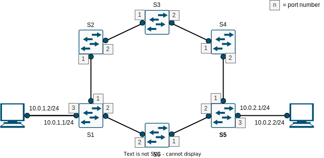

# SDN - Link failure detection

Team members: Giulio Siano, Francesco Gregori

Table of contents:

[TOC]

## Objectives
1. Design a ring network and monitor the link status through openflow functions
	- Create a mininet topo, and save the link status at each t (time interval)
2. Implement an algorithm to react to the link failure
	- Look at the openflow messages and reconfigure the Openflow tables accordingly (e.g. group tables)
3. Test the algorithm with different traffic generators (D-ITG, iperf)
	- D-itg: http://www.grid.unina.it/software/ITG/
	- Iperf: https://iperf.fr/
4. Display the results
	- Delay, pkt loss with and without the implemented algorithm

## Topology

The topology has been designed with six switches and two hosts which exchange traffic. 



Since it is a ring topology, as assumption each switch has only two interfaces (**assumption 1**) to be connected with other two switches. This topology is set up with the *topologyProject.py* file.

Each of the two hosts has an IP address, a MAC address (*00:00:00:00:00:01* for the first and *00:00:00:00:00:02* for the second) and a default gateway. In the topology the default gateway is represented as an interface of a switch (ex the third of S1 and S5) but actually it is emulated. This raises a problem: when the host h1 (or equivalently h2) sends a packet which destination is out of its network, it sets as destination the mac address of the default gateway, but because it is unknown the host sends an ARP request in broadcast mode. Since no device has that IP address the host is not able to reach any network. To avoid this problem, the mac address of the default gateway is given by configure it manually with the command *arp -s 10.0.1.1 00:00:00:00:00:11* for the host h1, and *arp -s 10.0.2.1 00:00:00:00:00:12* for the host h2 (in this case by *manually* we mean the command is launched when the *topologyProject.py* file starts).

## Paths

It is possible to identify two paths: the clockwise path (also called *path1*) and the counter-clockwise path (also called *path2*):


These two paths are built by just forwarding to the second interface every packet coming from the first. To have the *path2* is sufficient to reverse the order. Due to the assumption 1, this type of building the two paths is independent on the number of switches. The flow rules implementing this behavior are installed for every switch and they are:

```
    in_port=1,actions=output:2
    in_port=2,actions=output:1
```

The switches having a host connected (for instance, s1 and s5) require two additional flows: the first forwards to the host every packets having its IP address as destination address, the second sends out from the first interface all packets coming from the host. Below the additional rules for the switch s1:

```
    nw_dst=10.0.1.2,actions=mod_dl_dst:00:00:00:00:00:01,output:3
    in_port=3,actions=output:1
```
## Startup and first configuration

As soon as the switches go online the controller is contacted and the *table miss* rule is installed with the basic ones described in [*Paths*](#Paths). The ARP messages are handled by broadcasting them in case the destination MAC address is unknown otherwise by using the learned *mac_to_port* association.

Instead, when the controller starts a separated thread is launched: it executes a function that loops every 10 seconds and accomplishes the first [Objective](##Objectives).

## Periodic monitoring

The launched thread s captures the link status every 10 second. Indeed, the data can be gathered only if a request from the controller is submitted to the switches using the *OFPPortDescStatsRequest* function. The controller, that has been configured to listen for *EventOFPPortDescStatsReply* events (that is the switches replies), fills a dictionary that for each switch save its active links: those are ones whose state value is *4*.

## On link status changing

This section, together with the next ([the algorithm](##The Algorithm)), accomplishes the second [Objective](##Objectives). In particular, a way to get informed about the changing on the link status has been implemented by listening for *EventOFPPortStatus* event: when a link goes down the two incident interfaces go down as well, and their switches send (both of them) a message about the event to the controller. Their ids are then removed from the dictionary of the active interfaces and the algorithm to react to the failure is executed.

Instead, when the two interfaces go online again it is not necessary to perform any action: the dictionary will be updated on the next periodic monitoring. (This is left intentionally to the the periodic monitoring instead of taking any action to show the use of the group tables).

## The algorithm

This algorithm is executed when a link goes down, and so the two incident interfaces go down too. The switches the two interfaces belong to receive a message about their disconnection and, in order to overcome the failure, some group tables and flows are installed. 


In particular, the type of group table that helps to bypass the failed link is the *fast failover* one: it is made of buckets which, in turn, contains a watch port or/and group and a set of actions associated. A group table is used when the flow rule that specifies it as action is matched. The buckets are stored in the order given by the programmer: the selected bucket is the first whose watch port and/or group are enabled/working. If no bucket is matched, the packet is dropped. 
With the buckets of the fast failover group table is possible to implement the two [paths](##Paths). Let us define the following group tables: 


The idea behind the two is the following: if a failure involves two interfaces it is necessary to change the traversing of the network from the clockwise direction to the counter-clockwise (or vice versa). It can be summarized by the following sentences: if a packet is received from an interface forward it to the second if available. If not, forward it back from the first if available, drop it otherwise (remember that for the *assumption1* there are only two interfaces on each switch, without considering those for the hosts). The next switches has the flow rules defined in [paths](##Paths) (or the pair of group table shown above if previously affected by a failure) and so the packet is forwarded from one interface to another until the switch connected to the destination host is reached. 

The flow necessary to use the two tables are the following:

```
	in_port=1,actions=group:50
	in_port=2,actions=group:51
```


In the example, on S3 the group tables act as a **mirror** and, because the first flow rule is matched, the group whose id is 50 is executed: since the second interface is down, it performs the action shown in the bucket 2. 

When the failed link goes back online, the two interfaces are expected to go back online as well and, as said in [On link status changing](##On link status changing) section nothing changes: the first bucket of each group checks if the *opposite* interface with the respect to the input one is working, so the flow can go on in the same direction. If it does, send through it otherwise use the *mirror* behavior, resulting in the reversing of the direction of the flow. 

In the example above, the first bucket of the first group is about the second interface: when it becomes available again that bucket is used and the packet correctly forwarded to the switch S4. 

As already explained in [Paths](##Paths), the switches having a connected host requires some additional instructions. It is sufficient to use the two flows described above and the second group of flows written in [Paths](##Paths), with the modification of the second rule: when those switches receive a packet from the connected host, one of the two groups can be applied indifferently.

```
	in_port=3,actions=group:50
```

Even if the failed link goes back online, the group tables and the flow rules can be still used to normally forward the traffic as demonstrated before. Also, in case of repeated failure the switches already have this tool to quickly react to the event, without the need for instructions by the controller. 

## Pro and cons

The actions and information exchanged between switches and the controller are minimum: the discovery of the topology is indirectly performed when the controller periodically asks for port statuses. In addition, in order to bypass the link failure, no minim path computation is required but the only implementation of group tables, due to the assumptions and considerations made on the topology. 

Also, there are benefits in the long term: once the fast failover group tables are installed, they work both when the fail happens again and when it is resolved. So, once installed no further actions are required. This allows to save the time required by the minimum path time computation. However, the controller is still informed about the failed/working ports for a matter of statistics and detection of the topology changes.

If the advantages are only about the control plane and the time required to react to the failures, from the point of view of data plane there are some cons. Considering again the image above, once a failure happens and the group tables are installed, since the modifications are performed only on the two interfaces involved in the failure, the switches having the host connected will always send the packet in the direction of S3 wasting bandwidth and time (in this case two hops more are traversed). Those switches have no way to know the failure happened. The worse case is when the failure happens next to the destination host on the "main" path (where main we mean the path initially installed on the switches):


The ring topology is traversed twice.

Another particular case is when both of the two interfaces of a switch fail: in the time between the two failures some packets can arrive to the switch and be stuck in it. Indeed, when the group table is scanned, no interface is working, so the packets are dropped. 

## Results

TBD

## Usage

First, the controller must be executed:

```
	sudo ./ryu/bin/ryu-manager ryu/ryu/app/controllerProject.py
```

then, the topology:

```
	sudo python mininet/custom/topologyProject.py
```

After the first monitoring, is possible to start iperf or a simple ping between h1 and h2. With the command:

```
	sudo ovs-ofctl mod-port s4 s4-eth1 down
```

or simply,

```
	sudo ifconfig s4-eth1 down
```

we can simulate a link failure, also while the ping or iperf is still running. It can be seen the flow is still running with an initial delay and no dropouts.

In order to run iperf:

```
	mininet> xterm h1 h2
```

On h1 let us open a server:

```
	iperf3 -s 
```

On h2 a client:

```
	iperf3 -c 10.0.2.2
```

The flow starts and at the end some statistics are return. 
